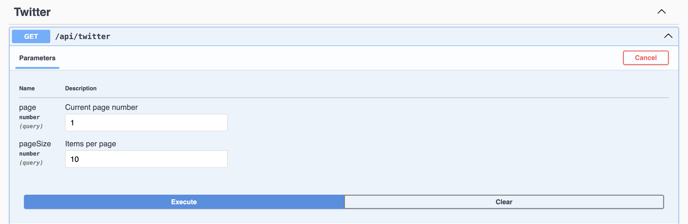

# Tweet Scraper API

This API allows you to scrape tweets from the CoinDesk Twitter channel, save them to a database, and retrieve them through a RESTful interface.

## Getting Started

Follow these steps to set up and run the Tweet Scraper API using yarn:

1. **Clone the Repository**: Clone this repository to your local machine.

    ```bash
    git clone <repository-url>
    ```

2. **Install Dependencies**: Navigate to the project directory and install the dependencies using yarn.

    ```bash
    cd tweet-scraper-api
    yarn install
    ```

3. **Create Resend Account and Generate API Key**: Visit the Resend website and sign up for an account if you haven't already. Once logged in, generate an API key for your account.

4. **Set Up Environment Variables**: Create a `.env` file in the root directory and configure the following environment variables:

    ```plaintext
    DB_HOST=127.0.0.1
    DB_PORT=5432
    DB_USERNAME=postgres
    DB_PASSWORD=postgres
    DB_DATABASE=scrapper_db
    PORT=3000
    FROM_EMAIL=<sender-email>
    TO_EMAIL=<recipient-email>
    RESEND_API_KEY=<resend_api_key>
    ```

5. **Run the Application**: Start the application.

    ```bash
    yarn start
    ```

6. **Access the API**: Once the application is running, you can access the API endpoints using the base URL `http://localhost:3000`.


## Endpoints

### 1. GET /api/tweets

Retrieve scraped tweets from the CoinDesk Twitter channel.

**Request:**

- Method: GET
- URL: `/api/tweets?page=1&pageSize=10`

**Response:**

```json
{
  "items": [
    {
      "username": "CoinDesk",
      "text": "Explore the trajectory of finance in the digital age with one of the industry’s key figures. Join @bullish CEO @ThomasFarley at #Consensus2024 in Austin where insightful perspectives await this May. Discover all the speakers.",
      "image": null
    },
    // Additional tweets...
  ],
  "totalCount": 22,
  "page": "1",
  "pageSize": "10"
}
```

## Screenshots

You can find screenshots of the request and response of the `/api/tweets` endpoint below:

### Request Screenshot



### Response Screenshot


## Testing

You can test the API endpoints using tools like cURL or Postman. Here's an example cURL command to retrieve tweets:

```bash
curl -X 'GET' 'http://localhost:3000/api/tweets?page=1&pageSize=10' -H 'accept: */*' -H 'Content-Type: application/json'
```

## License

This project is licensed under the [MIT License](LICENSE). You are free to use, modify, and distribute the code for both commercial and non-commercial purposes, as long as you include the original copyright notice and license terms.
